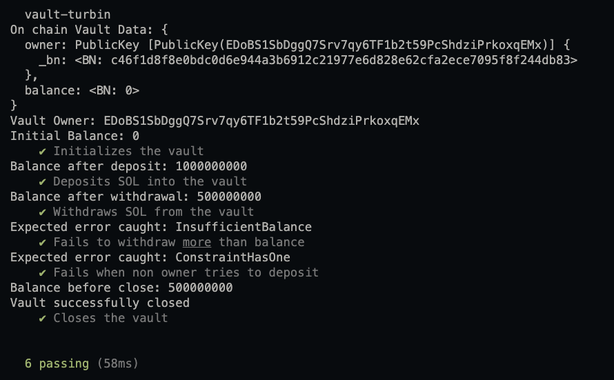

# Vault Turbin

A Solana program built with the Anchor framework that implements a simple vault system for managing SOL deposits and withdrawals. This program demonstrates fundamental Anchor development patterns including account management, instruction handling, error handling, and event emission.

## Overview

Vault Turbin provides a secure mechanism for users to create personal vaults on the Solana blockchain. Each vault is owned by a single user who can deposit SOL, withdraw SOL, and close the vault when no longer needed. The program enforces ownership constraints to ensure only the vault owner can perform operations on their vault.

## Program Architecture

### State

The program maintains a single account type:

**Vault**
| Field   | Type    | Description                          |
|---------|---------|--------------------------------------|
| owner   | Pubkey  | The public key of the vault owner    |
| balance | u64     | The tracked balance within the vault |

### Instructions

The program exposes four instructions:

| Instruction             | Description                                                                 |
|------------------------|-----------------------------------------------------------------------------|
| `intialize_instruction` | Creates a new vault account and sets the caller as the owner               |
| `deposit_instruction`   | Deposits SOL into the vault and updates the balance                        |
| `withdraw_instruction`  | Withdraws SOL from the vault if sufficient balance exists                  |
| `close_instruction`     | Closes the vault account and returns rent to the owner                     |

### Events

The program emits events for tracking vault activity:

| Event          | Fields | Description                              |
|----------------|--------|------------------------------------------|
| DepositEvent   | amount | Emitted when SOL is deposited            |
| WithdrawEvent  | amount | Emitted when SOL is withdrawn            |

### Error Codes

| Error               | Code | Message               |
|---------------------|------|-----------------------|
| InsufficientBalance | 6000 | Insufficient balance  |
| Unauthorized        | 6001 | Unauthorized          |

## Project Structure

```
vault-turbin/
├── programs/
│   └── vault-turbin/
│       └── src/
│           ├── lib.rs              # Program entry point
│           ├── errors.rs           # Custom error definitions
│           ├── events.rs           # Event definitions
│           ├── state/
│           │   ├── mod.rs
│           │   └── vault.rs        # Vault account structure
│           └── instructions/
│               ├── mod.rs
│               ├── initialize.rs   # Initialize instruction
│               ├── deposit.rs      # Deposit instruction
│               ├── withdraw.rs     # Withdraw instruction
│               └── close.rs        # Close instruction
├── tests/
│   └── vault-turbin.ts             # Integration tests
├── Anchor.toml                     # Anchor configuration
├── Cargo.toml                      # Rust dependencies
└── package.json                    # Node.js dependencies
```

## Prerequisites

Before building and testing this program, ensure the following tools are installed:

| Tool        | Version | Installation                                    |
|-------------|---------|------------------------------------------------|
| Rust        | 1.75+   | https://rustup.rs                              |
| Solana CLI  | 2.0+    | https://docs.solana.com/cli/install-solana-cli-tools |
| Anchor      | 0.32+   | https://www.anchor-lang.com/docs/installation  |
| Node.js     | 18+     | https://nodejs.org                             |
| Yarn        | 1.22+   | https://yarnpkg.com                            |

## Installation

Clone the repository and install dependencies:

```bash
git clone <repository-url>
cd vault-turbin
yarn install
```

## Building

Build the Solana program:

```bash
anchor build
```

This command compiles the Rust program and generates the IDL (Interface Description Language) file at `target/idl/vault_turbin.json`.

## Testing

Run the test suite against a local validator:

```bash
anchor test
```

This command performs the following steps:
1. Builds the program
2. Starts a local Solana validator
3. Deploys the program
4. Executes the TypeScript test suite
5. Shuts down the validator

## Tests Output



### Test Coverage

The test suite validates the following scenarios:

| Test Case                          | Description                                      |
|------------------------------------|--------------------------------------------------|
| Initializes the vault              | Verifies vault creation with correct owner       |
| Deposits SOL into the vault        | Confirms balance updates after deposit           |
| Withdraws SOL from the vault       | Validates balance reduction after withdrawal     |
| Fails to withdraw more than balance| Ensures InsufficientBalance error is thrown      |
| Fails when non owner tries to deposit | Confirms ownership constraint enforcement     |
| Closes the vault                   | Verifies vault account deletion                  |

## Deployment

### Localnet

For local development and testing:

```bash
anchor test
```

### Devnet

To deploy to Solana Devnet:

1. Update `Anchor.toml` to use devnet:
```toml
[programs.devnet]
vault_turbin = "<program-id>"

[provider]
cluster = "devnet"
```

2. Ensure your wallet has sufficient SOL for deployment:
```bash
solana airdrop 2 --url devnet
```

3. Deploy the program:
```bash
anchor deploy --provider.cluster devnet
```

### Mainnet

For production deployment to Mainnet:

1. Update `Anchor.toml` configuration
2. Ensure adequate SOL for deployment costs
3. Follow Solana security best practices for key management
4. Deploy using a secure signing process

## Program ID

| Network   | Program ID                                        |
|-----------|--------------------------------------------------|
| Localnet  | FHCukF88jMQoTSTVb5n7RLTasx91kNZm2cDihpqTMx8o     |
| Devnet    | FHCukF88jMQoTSTVb5n7RLTasx91kNZm2cDihpqTMx8o     |

## Usage Example

The following TypeScript example demonstrates how to interact with the deployed program:

```typescript
import * as anchor from "@coral-xyz/anchor";
import { Program } from "@coral-xyz/anchor";
import { VaultTurbin } from "../target/types/vault_turbin";
import { Keypair, LAMPORTS_PER_SOL } from "@solana/web3.js";

// Setup provider and program
const provider = anchor.AnchorProvider.env();
anchor.setProvider(provider);
const program = anchor.workspace.vaultTurbin as Program<VaultTurbin>;

// Generate vault keypair
const vaultKeypair = Keypair.generate();

// Initialize vault
await program.methods
  .intializeInstruction()
  .accounts({
    vault: vaultKeypair.publicKey,
    owner: provider.wallet.publicKey,
  })
  .signers([vaultKeypair])
  .rpc();

// Deposit 1 SOL
await program.methods
  .depositInstruction(new anchor.BN(LAMPORTS_PER_SOL))
  .accounts({
    vault: vaultKeypair.publicKey,
  })
  .rpc();

// Withdraw 0.5 SOL
await program.methods
  .withdrawInstruction(new anchor.BN(0.5 * LAMPORTS_PER_SOL))
  .accounts({
    vault: vaultKeypair.publicKey,
  })
  .rpc();

// Close vault
await program.methods
  .closeInstruction()
  .accounts({
    vault: vaultKeypair.publicKey,
  })
  .rpc();
```

## Security Considerations

This program implements the following security measures:

1. **Ownership Verification**: All vault operations require the owner to be a signer, enforced through Anchor's `has_one` constraint.

2. **Balance Validation**: Withdrawal operations validate that sufficient balance exists before proceeding.

3. **Account Closure**: The close instruction properly returns rent to the vault owner.

Note: This is a demonstration program. For production use, consider additional security audits and implement proper SOL transfer mechanics for actual fund management.

## License

This project is licensed under the ISC License.
